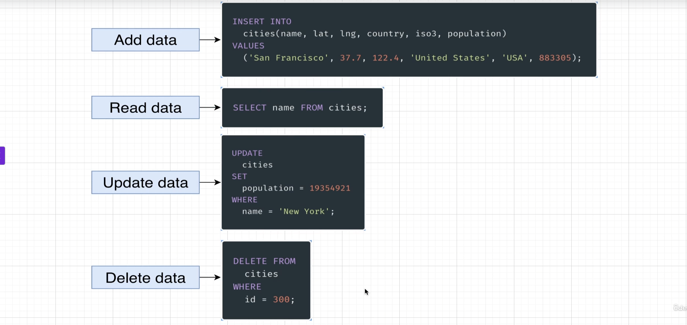

###### <div style="text-align:right">[table of contents](#table-of-contents)</div>

## section01 - simple-but-powerful-sql-statements

### Basics

- SQL is a language used to communicate with a database (eg. oracle, MS SQL server, Mysql, Postgres).
- Keywords are always capital letters
- identifiers are always lowercase.
- [pg-sql.com](http://pg-sql.com) is a web interface that can test SQL statements



#### Create table / delete table

###### create

```SQL
CREATE TABLE _ ();
```

```SQL
CREATE TABLE cities (
  name VARCHAR(50),
  country VARCHAR(50),
  population INTEGER,
  area INTEGER
);
```

###### delete

```SQL
DROP TABLE _;
```

```SQL
DROP TABLE cities;
```

---

#### Read

```SQL
SELECT _ FROM _;
```

###### eg: select all from table

```SQL
SELECT * FROM cities;
```

###### eg: select name, country from table

```SQL
SELECT name, country FROM cities;
```

###### eg: calculated columns

```SQL
SELECT name, population / area AS population_density
FROM cities;
```

---

#### Add

```SQL
INSERT INTO _ () VALUES ();
```

###### eg. when adding items into cities the 'INSERT' column names and 'VALUES' need to match-up

```SQL
INSERT INTO cities (name, country, population, area)
VALUES
('Tokyo', 'Japan', 3556566, 9333),
('Delhi', 'India', 24434534, 2323);
```

---

#### Update

```SQL
UPDATE _ SET _ WHERE _;
```

###### eg.

```SQL
UPDATE cities
SET population = 1294934
WHERE name = 'New York';
```

---

#### Delete

```SQL
DELETE FROM _ WHERE _;
```

###### eg.

```SQL
DELETE FROM cities WHERE id = 300;
```

---

#### String operators and functions

##### || or CONCAT()

###### eg. joins 2 strings - join 'name' and 'country' separate with ', '

```SQL
SELECT name || ', ' || country AS location FROM cities;
```

```SQL
SELECT CONCAT(name, ', ', country) AS location FROM cities;
```

##### LOWER()

###### eg. gives a lower case string

```SQL
SELECT
LOWER(CONCAT(name, ', ', country)) AS location
FROM cities;
```

##### UPPER()

###### eg. gives an upper case string

```SQL
SELECT
UPPER(CONCAT(name, ', ', country)) AS location
FROM cities;
```

##### LENGTH()

###### eg. gives number of characters in a string

```SQL
SELECT LENGTH('HELLO');
```

##### COALESCE()

Coalesce returns the first value from list that is NOT null.
eg. ensures that either post_id OR comment_id is available.

```SQL
SELECT (
  COALESCE((post_id)::BOOLEAN::INTEGER, 0)
+
  COALESCE((comment_id)::BOOLEAN::INTEGER, 0)
) = 1

```

---
